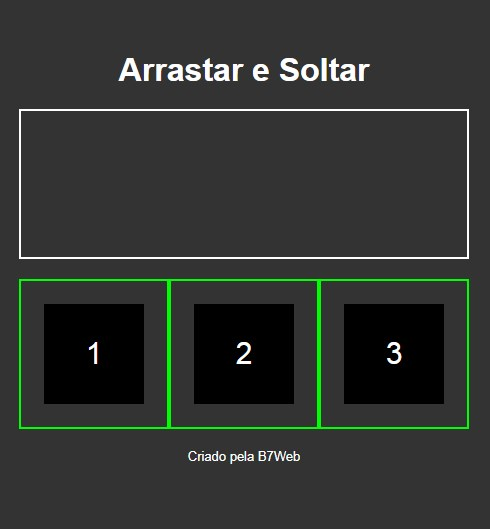

<h1 align="center">
  Arrastar e Soltar JavaScript
</h1>

## 📋 Índice

- [Preview](#-Preview)
- [Sobre](#-Sobre)
- [Tecnologias utilizadas](#-Tecnologias-utilizadas)
- [Como executar o projeto](#-Como-executar-o-projeto)

---

## 🖥 Preview

  

---

## 📖 Sobre 

Projeto muito interessante utilizando recursos de dragging e drop no javascript, projeto consistia em arrastar três caixas numéricas para sua devida sequencia e verificar se estavam ordenadas. Projeto feito como exercício proposto pelo professor Bonieky Lacerda.

---

## 🚀 Tecnologias utilizadas
O projeto está sendo desenvolvido com as seguintes tecnologias:
- HTML5
- CSS3
- JavaScript

---

## ⌨ Como executar o projeto

Baixe o arquivo .ZIP do projeto e após descompactar abra com seu navegador o arquivo index.html.

---
